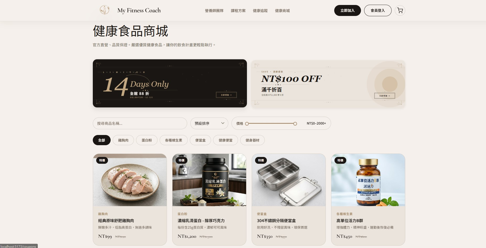
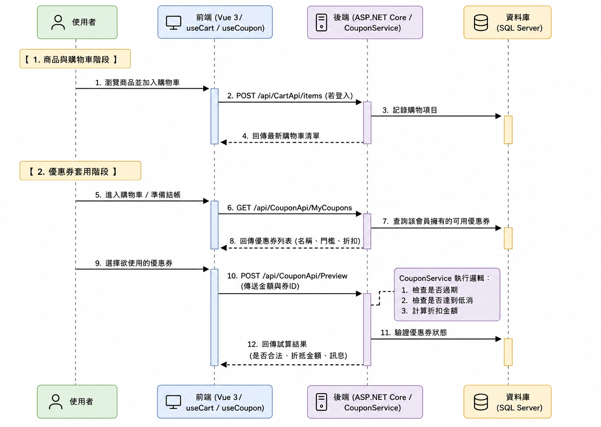
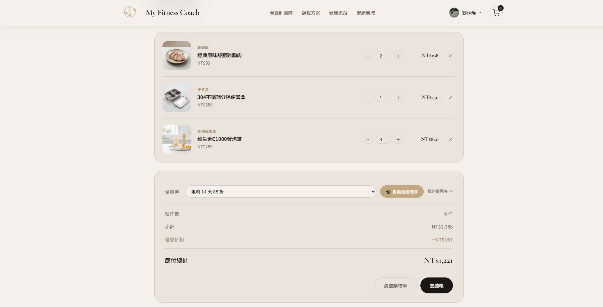
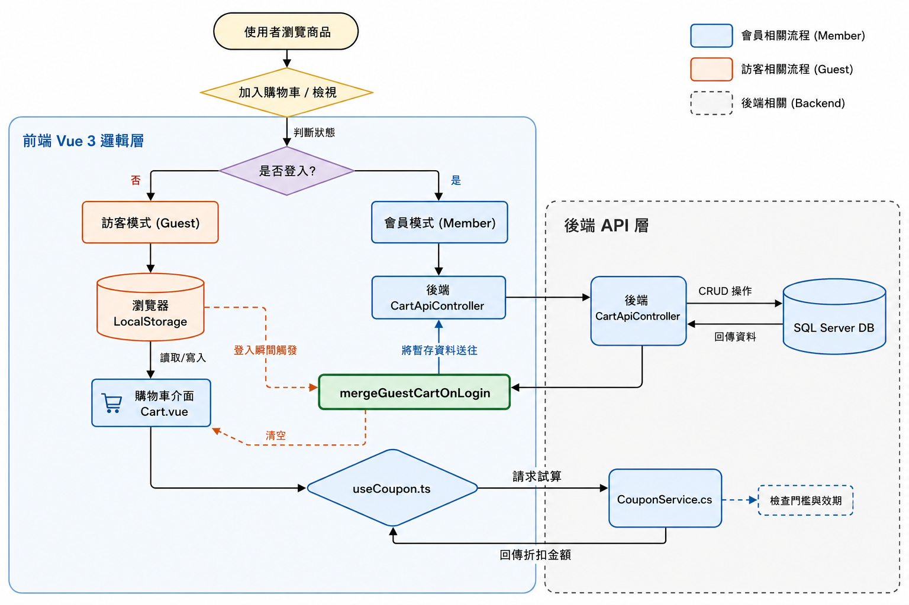
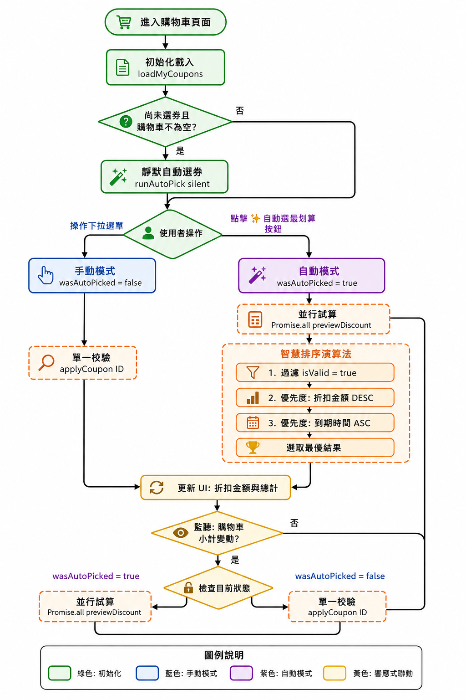

# MyFitnessCoach 我的飲食教練

> **整合健康管理與電商機制的全端 Web 應用程式**  
> 本專案採前後端分離架構，實現了高效能的商品檢索、智能購物車同步機制以及自動化優惠券推薦引擎。

---

## 專案演示
*   **展示影片**：[YouTube 連結](https://www.youtube.com/live/lV-r9YCWR1M?si=fEuAUQfGrfINzAiT)
*   **核心功能快轉**：
    *   訪客購物車登入後自動合併 (23:15–24:30)
    *   智能優惠券推薦與自動試算 (26:08–28:30)

*商城首頁：多維度商品篩選與動態廣告牆*

---

## 系統架構設計

本專案核心理念為「高內聚、低耦合」，確保系統具備商業級的擴充性。

*   **前後端分離 (Decoupled Architecture)**：由 ASP.NET Core Web API 提供 RESTful 服務，Vue 3 負責驅動極致流暢的 UI 互動。
*   **後端三層式架構 (3-Tier Architecture)**：
    *   **Presentation (Controller)**：負責請求校驗與 API 端點曝露。
    *   **Business Logic (Service)**：封裝核心業務規則（如優惠券權重演算法）。
    *   **Data Access (Repository/EF Core)**：專注於 SQL Server 資料操作，提升維護效率。

---

## 個人核心貢獻：電商核心模組

我主導開發了商城系統最核心的三大模組，解決了複雜的狀態同步與運算邏輯。

### 1. 智能購物車系統 (Smart Cart System)
解決了跨裝置、跨身分（訪客/會員）的資料同步痛點。

**購物車管理介面**

**登入後自動合併機制**

*   **全站單例狀態管理**：使用 Vue Composable 結合 Module-level Singleton，確保 Navbar、商品列表與購物車頁面的資料毫秒級同步。
*   **離線優先合併演算法**：訪客購物資料持久化於 LocalStorage，登入後自動觸發後端 `MergeAsync` 邏輯，將本地購物車與資料庫合併——相同商品自動累加數量，不會重複出現。

### 2. 優惠券推薦引擎 (Coupon Engine)
實作「自動挑選最省錢組合」的智能體驗。

*圖示：系統自動並行試算所有優惠券，並選出最佳折扣方案*

*   **加權排序演算法**：當小計變動時，系統自動依據「最大折扣金額」與「到期日權重」進行排序，自動推薦最優券。
*   **非同步效能優化**：利用 `Promise.allSettled` 處理批次領券流程，確保在個別請求失敗時不中斷整體操作，並提供精確的反饋。

### 3. 高效能商品檢索 (Product Search)
*   **LINQ 延遲執行 (Deferred Execution)**：後端 Service 僅構建查詢樹 (IQueryable)，將過濾邏輯（關鍵字、分類、價格）下推至 SQL Server 端執行，大幅降低記憶體開銷。
*   **動態條件組合**：支援多維度篩選，實現 API 驅動的極速搜尋反應。

---

## 技術棧 (Tech Stack)

| 領域 | 技術工具 |
| :--- | :--- |
| **後端** | .NET 8 Web API, Entity Framework Core, LINQ |
| **前端** | Vue 3 (Composition API), Vite, TypeScript, Element Plus, Vuetify, Vue Router, Chart.js |
| **資料庫** | SQL Server |
| **版本控制** | Git, GitHub |

---

## 專案結構導覽 (核心部分)

### 後端 API (MyFitnessCoach_Server)
*   `Controllers/CartApiController.cs` - 購物車持久化與合併 API
*   `Models/Services/CouponService.cs` - 優惠券試算、驗證與領用邏輯
*   `Models/Services/ProductService.cs` - 動態 LINQ 商品查詢實作

### 前端 Vue (MyFitnessCoach_Client)
*   `src/composables/useCart.ts` - 購物車單例狀態與本地存儲管理
*   `src/composables/useCoupon.ts` - 優惠券自動挑選演算法
*   `src/views/Store.vue` - 商城主介面與動態篩選實作

---
